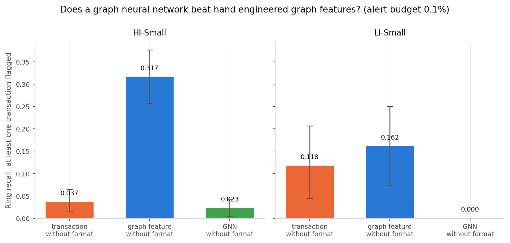

# Does a graph neural network earn its keep, streamed and orchestrated

[](https://github.com/JAYANSHUBADLANI/laundering-ring-streaming-gnn/actions/workflows/tests.yml)

This extends [`laundering-ring-detection`](https://github.com/JAYANSHUBADLANI/laundering-ring-detection)
rather than starting from the data again. That project already showed that
hand engineered account level graph features, fed into gradient boosting,
find laundering rings that a transaction-only model cannot. It reuses that
project's data, its account graph construction, and its evaluation rules
exactly. What it adds is three things the source project does not have: a
Kafka ingestion layer that replays the dataset as if it were arriving live
instead of reading the whole file at once, an orchestrated retraining
pipeline instead of scripts run by hand, and a graph neural network trained
end to end instead of hand engineered features.

The claim under test, stated before any of these numbers existed:

> A graph neural network trained end to end on the transaction graph detects
> laundering rings at least as well as hand engineered graph features fed
> into gradient boosting, despite needing no manual feature design.

This was a real question going in, not a foregone conclusion in the GNN's
favour. Hand engineered features can beat a GNN on a graph this size, and
`laundering-ring-detection`'s own graphs, half a million accounts and well
under a million structural edges, are exactly that scale.

## Status

Environment checks, the streaming correctness proof, the orchestrated
pipeline, and the GNN vs. gradient boosting comparison on both splits are
done. Numbers below are all from running the code in this repository, none
quoted or recalled.

## Why a separate repository

`laundering-ring-detection`'s phases 1 to 3, its data quality checks, and its
transaction and graph feature baselines are inputs to this project, not
things to redo. This repository imports that project's data and reused code
rather than duplicating either, on the assumption that it is cloned as a
sibling directory (see [Running it](#running-it)). It lives in its own
repository rather than as new phases in the original one because it adds
three dependency clusters, Kafka and Docker, an orchestrator, and PyTorch,
that have nothing to do with the original's tight, already complete
dependency set; bolting them onto a finished project would make that
project's own story harder to read, not easier.

## Environment checks, before any of this was built

Full detail in [`docs/environment_notes.md`](docs/environment_notes.md).
Summary:

- **Dataset**: already present from the source repository's own fetch. Not
  re-downloaded.
- **Docker**: installed but the daemon was not running; started it, then
  confirmed a container actually executes (`docker run hello-world`), not
  just that the binaries exist.
- **PyTorch Geometric vs. DGL**: PyTorch Geometric installed cleanly (torch
  2.14.0, torch_geometric 2.8.0.post1) with Apple GPU (MPS) support on this
  machine, and both `SAGEConv` and `GCNConv` round tripped a test tensor.
  DGL was never needed.
- **Orchestrator**: Dagster started cleanly in about three seconds. Airflow
  installed too, but its scheduler and triggerer processes crash looped with
  repeated SIGSEGV on this machine, even with the standard macOS fork-safety
  workaround, and never reached a state where a DAG could run. Dagster was
  chosen for that concrete reason, not convention.
- **Compute**: one full-batch GraphSAGE training step over HI-Small's entire
  training window (3,554,066 transactions, 513,284 accounts) settles to
  about 1.2 seconds per epoch on this machine's GPU, and a full retrain
  cycle is on the order of a minute. LI-Small, only 37 percent larger by
  every count that should matter, turned out to cost roughly 45 times more
  per epoch, a real and reproduced finding rather than an estimate; see
  [What the GNN costs](#what-the-gnn-costs) and
  [`docs/environment_notes.md`](docs/environment_notes.md).

## The streaming layer

A Kafka broker in Docker (`infra/kafka/docker-compose.yml`, one broker,
KRaft mode, no Zookeeper). A producer
([`scripts/produce_stream.py`](scripts/produce_stream.py)) replays a split's
transactions in timestamp order at a configurable rate, keyed by
`from_account`. A consumer
([`scripts/consume_stream.py`](scripts/consume_stream.py),
[`src/amlgnn/consumer.py`](src/amlgnn/consumer.py)) drains the topic and
maintains the account graph incrementally
([`src/amlgnn/incremental_graph.py`](src/amlgnn/incremental_graph.py)): one
transaction updates the accounts and account-pair edges it touches, rather
than the graph being rebuilt from the full transaction set on every message.

This is a simulation of arrival order from a static, already-collected
dataset. It is not a live feed, and the schedule that follows runs against
that simulation, not against anything real time.

### Does the streamed graph match the batch graph, checked directly

[`scripts/verify_stream_equivalence.py`](scripts/verify_stream_equivalence.py)
builds the account graph two independent ways over the identical
transactions: once as a single batch SQL query plus a pandas dedupe
(`amlgnn.graph_build.batch_structure`), and once by replaying every
transaction through the real Kafka broker and folding it into
`IncrementalGraphState` one message at a time. The two are compared for
exact set equality, not similar counts.

| split | segment | transactions | accounts | edges | match |
| --- | --- | --- | --- | --- | --- |
| HI-Small | train | 3,554,066 | 513,284 | 588,606 | exact |
| LI-Small | train | 4,846,510 | 703,504 | 802,623 | exact |

Both accounts and edges matched exactly, zero missing on either side, at
full scale, not on a bounded sample. Full output in
[`results/stream_equivalence_HI-Small_train.json`](results/stream_equivalence_HI-Small_train.json)
and
[`results/stream_equivalence_LI-Small_train.json`](results/stream_equivalence_LI-Small_train.json).

## The orchestration layer

A Dagster job (`orchestration/definitions.py`) with three ops in sequence:
pull whatever is new on the Kafka topic
(`pull_latest_consumed_transactions`), compact the landed table into one
physically ordered segment (`update_graph`), then refresh graph features,
retrain the gradient boosting baseline, retrain the GNN, and score both
against the fixed holdout (`refresh_features_and_retrain`). A sensor
(`new_data_sensor`) fires a run when either split's consumed-transaction
count has grown since the last run it triggered, polling the consumer's own
checkpoint file rather than needing a second signalling mechanism.

`dagster dev -f orchestration/definitions.py` runs the real thing: a working
scheduler, sensor and web UI, not a diagram of one.
[`scripts/run_dagster_job_once.py`](scripts/run_dagster_job_once.py) runs
the identical job definition through Dagster's execution engine for a single
scriptable invocation, which is how this project's own multi-cycle
experiment drives it. Run end to end through Dagster's own execution engine
(not just imported and checked for syntax), it reproduced HI-Small's
standalone comparison numbers exactly, 0.3165 graph feature against 0.0229
GNN ring recall, in 2 minutes 32 seconds: the orchestration wrapper changes
nothing about what gets fitted or how it is scored.

## The model

GraphSAGE, not a GCN: both installed and ran cleanly in the environment
check, and GraphSAGE was picked because it learns an aggregation function
over a node's neighbourhood rather than assuming the fixed,
degree-normalised propagation a GCN does, which fits an account graph with
wildly uneven degree better. Two layers, trained end to end for edge
(transaction) classification: each account gets a learned embedding, two
rounds of message passing refine it using the training-window structure
only, and a transaction is scored from its two endpoints' embeddings plus
its own attributes (log amount, same bank, self loop, hour, day of week,
round amount flags, currency), through a small MLP head.

Leakage is avoided the way the existing graph feature model avoids it. The
node vocabulary and the message passing structure are both built from the
training window only. An account never seen in training does not get a zero
vector: it gets one shared, learned "unseen account" embedding, the neural
equivalent of the null the existing project's gradient booster receives for
the same account. Class imbalance, one laundering transaction in roughly a
thousand, is handled with a weighted binary cross entropy loss rather than
the small-leaf trick `HistGradientBoostingClassifier` relies on, since a
neural network has no leaves to shrink.

Every model here is fitted twice, with `payment_format` and without it,
for the same reason the existing project fits its own models twice: the
data generator writes a format signature into laundering transactions, and a
model that reads it looks good for a reason that has nothing to do with
detecting structure.

### A reproducibility issue this ran into, worth stating plainly

The gradient boosting baseline is refit here, on this project's own landed
(streamed) copy of the data, rather than read from the source repository's
committed numbers, so that a divergence would be caught rather than assumed
away. The first two attempts at that gave two different, and different from
committed, ring recall numbers on identical data. Both were tracked down,
not shrugged off: a scikit-learn version drift between the two projects'
virtual environments, and a row-order sensitivity in
`HistGradientBoostingClassifier` triggered by streaming's many small
appended inserts leaving the landed table fragmented. Full account in
[`docs/environment_notes.md`](docs/environment_notes.md). The retrained
baseline below is stable run to run after both fixes; it is not bit-identical
to the source repository's committed number, because it is now a different,
but internally consistent, physical row order than the original bulk CSV
load produced, not because retraining is inherently unreliable.

## The result

**The claim does not survive.** Ring recall at the 0.1 percent alert budget,
at least one transaction flagged, 95 percent bootstrap intervals, on data
landed through this project's own streaming path and retrained with both
`laundering-ring-detection`'s existing code and the new GNN:

| split | model | ring recall | interval |
| --- | --- | --- | --- |
| HI-Small | transaction, without format | 0.0367 | 0.0138 to 0.0642 |
| HI-Small | graph feature, without format | 0.3165 | 0.2569 to 0.3761 |
| HI-Small | GNN, without format | **0.0229** | 0.0046 to 0.0414 |
| LI-Small | transaction, without format | 0.1176 | 0.0441 to 0.2059 |
| LI-Small | graph feature, without format | 0.1618 | 0.0735 to 0.25 |
| LI-Small | GNN, without format | **0.0** | 0.0 to 0.0 |



On HI-Small, the hand engineered graph feature model catches 31.65 percent
of evaluable rings; the GNN catches 2.29 percent, barely above the
transaction only model's 3.67 percent and with an interval that overlaps it.
The graph feature model's interval, 0.2569 to 0.3761, does not overlap the
GNN's, 0.0046 to 0.0414, at all: this is not noise. A GNN trained end to end
on exactly the same account graph did not recover what a few dozen hand
engineered aggregates recover directly.

On LI-Small the gap is starker and simpler to state: **both** GNN variants,
with `payment_format` and without it, caught zero of the 68 evaluable
rings, across every one of the 2,000 bootstrap resamples, an interval of
exactly 0.0 to 0.0 either way. The graph feature model, on the identical
data and the identical evaluation, caught 16.18 percent without the format
column. LI-Small was already the split `laundering-ring-detection` itself
said to read with caution, since only 68 of its 117 rings are evaluable and
its own intervals run wide; a result of exactly zero does not need a wide
interval to be decisive. Full tables, every variant on both splits, in
[`results/gnn_evaluation_20260912T214134Z.csv`](results/gnn_evaluation_20260912T214134Z.csv)
(HI-Small) and `results/cycle_LI-Small_20260912T235012Z_*_evaluation.csv`
plus `results/cycle_LI-Small_20260913T001852Z_gnn_without_format_evaluation.csv`
(LI-Small, one file per model family, written the moment that family
finished rather than only at the end of the whole run).

This was flagged as a real possibility before any of it was run: hand
engineered features can beat a GNN on a graph this size, and on both splits
tried here, that is what happened.

## Where the GNN loses, and why

Ring recall by typology, HI-Small, without `payment_format`, at the primary
budget:

| typology | rings | graph feature | GNN |
| --- | --- | --- | --- |
| FAN-OUT | 24 | 0.500 | 0.000 |
| GATHER-SCATTER | 40 | 0.425 | 0.050 |
| SCATTER-GATHER | 30 | 0.367 | 0.000 |
| FAN-IN | 25 | 0.320 | 0.000 |
| STACK | 25 | 0.320 | 0.080 |
| BIPARTITE | 18 | 0.278 | 0.000 |
| RANDOM | 24 | 0.167 | 0.042 |
| CYCLE | 32 | 0.125 | 0.000 |

The graph feature model reads every typology at a rate between 0.125 and
0.5. The GNN reads five of eight typologies at exactly zero and the
remaining three barely above it, essentially indistinguishable from the
transaction only model's own typology breakdown
(`results/gnn_by_typology_20260912T214134Z.csv`). The GNN is not selectively
failing on the typologies the existing project already flags as hard (cycle
and chain shapes, where every account has degree about two and nothing is
locally unusual): it is failing broadly, including on the hub shaped
typologies, fan-out and scatter-gather, that the hand engineered features
read best because a hub is exactly what plain degree and partner
concentration counts were built to see.

LI-Small is the same story with no partial credit. Both GNN variants score
exactly zero on every one of the eight typologies
(`results/cycle_LI-Small_20260912T235012Z_gnn_with_format_by_typology.csv`,
`results/cycle_LI-Small_20260913T001852Z_gnn_without_format_by_typology.csv`),
while the graph feature model still reads six of the eight at a rate
between 0.111 and 0.375
(`results/cycle_LI-Small_20260912T235012Z_gbm_by_typology.csv`): only FAN-IN
and FAN-OUT come back at zero for the graph model too, and LI-Small has far
fewer evaluable rings per typology (6 to 10, against HI-Small's 18 to 40)
for a single caught ring to move the rate a long way. The GNN's complete
failure here is not a smaller version of the HI-Small result; it is total,
on the split with less data per typology to learn from in the first place.

The likely reason sits in what the two models are asked to learn from the
same structure. `laundering-ring-detection`'s graph features are direct,
supervised-by-design summaries: degree, reciprocal partner counts, a
passthrough ratio, partner concentration, aggregated over every account
before a single label is seen, hard-coding exactly the kind of local
irregularity a hub or a passthrough account produces. The GNN has to
discover an equivalent signal itself, from two rounds of message passing and
a single scalar loss, at a positive rate of about one in a thousand, with no
per-transaction edge weighting during message passing (transaction
attributes only re-enter at the classifier head, after the structural
embedding is already fixed). Two GraphSAGE layers over a graph with a median
account degree of about 20 give each node a two-hop receptive field that
should be wide enough to see a hub; what is much less certain is whether a
weighted binary cross entropy loss this imbalanced gives that receptive
field enough signal to learn anything more specific than "most things are
not laundering," which is consistent with recall this close to zero across
most typologies rather than a graded failure concentrated on the hard ones.

## What the GNN costs

| split | model | train | inference | one full retrain cycle |
| --- | --- | --- | --- | --- |
| HI-Small | gradient boosting, 4 variants | — | — | 20.2s (fit + score all four) |
| HI-Small | GNN, one variant, 30 epochs | 35 to 65s | 0.4 to 16s | — |
| LI-Small | gradient boosting, 4 variants | — | — | 34.8 to 38.5s |
| LI-Small | GNN, one variant, 30 epochs | 1618 to 1819s (27 to 30 min) | 10 to 13s | — |

On HI-Small the GNN is cheap: training one variant is a fraction of a
minute, in the same order of magnitude as the gradient boosting refit it is
being compared against. On LI-Small it is not: 30 epochs took between 1618
and 1819 seconds across three separate measurements of the `with_format`
variant (three attempts, because the first two did not survive to write a
result; see below), roughly 45 times HI-Small's training cost for a graph
only 37 percent larger by every count that should matter to GraphSAGE
(accounts, structural edges, training transactions) and with a nearly
identical account degree distribution (mean 19.6, 99.9th percentile about
190, on both splits). That is not proportional scaling, and it was checked
rather than shrugged off: full detail, including the swap and memory
measurements taken while it was reproduced, is in
[`docs/environment_notes.md`](docs/environment_notes.md). It remains an
open question, not a fully root-caused one, within this project's time
budget. It also cost this project two runs that trained successfully but
died before writing a result, once to a manual kill after 30 minutes with
no visible progress and once to what the machine's own swap usage strongly
suggests was an out-of-memory kill; `amlgnn.pipeline.run_cycle` writes each
model family's results to disk the moment that family finishes specifically
because of this, so the run that finally completed did not have to redo
gradient boosting or the `with_format` GNN to get the `without_format`
number that had been missing.

Retraining cost inside the orchestrated pipeline is the same numbers above,
run through `amlgnn.pipeline.run_cycle` instead of a bare script: a full
cycle (compact, refresh graph features, retrain gradient boosting, retrain
both GNN variants, score everything) is about a minute on HI-Small and
upward of an hour on LI-Small for the reason above. The three-cycle
retraining experiment below was run on HI-Small for exactly this reason: its
per-cycle cost had already been established directly, repeatedly, in
minutes, while LI-Small's has an open, order-of-magnitude question mark on
it that three repeated cycles would only have made more expensive to
diagnose under time pressure rather than better understood.

## What retraining on more streamed data actually buys

Three scheduled cycles, on HI-Small: the fixed test window streamed once,
then the training window streamed in three time-ordered thirds through the
real Kafka broker, one third landed before each cycle's retrain, so this is
the orchestrated pipeline actually run three times, not one run's numbers
split into a table. The thirds are equal in time, not in row count (HI-Small's
own traffic is not uniform across the training window), so cycle 1 already
carried 1,923,213 of the eventual 3,554,066 training transactions, cycle 2
added 569,934 more, and cycle 3 added the remaining 1,060,919. Ring recall
at the primary budget, without `payment_format`:

| model | cycle 1 (1.92M txns) | cycle 2 (2.49M txns) | cycle 3 (3.55M txns) |
| --- | --- | --- | --- |
| graph feature | 0.0550 | 0.1376 | 0.3165 |
| GNN | 0.0000 | 0.0459 | 0.0229 |

**Retraining on more streamed data does move ring recall, and it does not
plateau, but only for the model that was already working.** The graph
feature model's recall climbs steadily and substantially as more training
data lands, 0.055 to 0.138 to 0.317, nearly six times over from the first
cycle to the last, with no sign of levelling off by the third cycle: this
project's data does not run out of signal for that model in three cycles.
The GNN moves too, but within a much narrower band that never leaves the
range noise alone could produce, up to 0.046 in cycle 2 and back down to
0.023 in cycle 3; whatever moved it up in cycle 2 and down again in cycle 3
looks like fitting variance around a value close to zero, not a trend.
`payment_format` variants and every intermediate cycle's full table are in
[`results/multi_cycle_summary_HI-Small_20260913T005233Z.csv`](results/multi_cycle_summary_HI-Small_20260913T005233Z.csv),
with each cycle's complete per-variant evaluation and typology breakdown
also written under `results/cycle_HI-Small_<cycle-stamp>_*` at the time it
ran.

More data clearly helps the model that already had a way to use it. It has
not, in three cycles, given the GNN one.

## What this is not

Not a rebuild of `laundering-ring-detection`. Its phases 1 through 3, its
data quality checks, and its transaction and graph feature baselines are
reused, not redone.

Not a claim about a production system. The Kafka replay simulates arrival
order from a dataset that was already fully collected; the orchestrated
schedule runs against that simulation. Nothing here talks to a real bank, a
managed broker, or a managed orchestrator, and no cloud billing is enabled
anywhere in this project.

## Running it

Clone this repository as a sibling of `laundering-ring-detection`, with its
own data already fetched (see that repository's own `README.md`):

```bash
git clone https://github.com/JAYANSHUBADLANI/laundering-ring-detection.git
git clone https://github.com/JAYANSHUBADLANI/laundering-ring-streaming-gnn.git
cd laundering-ring-streaming-gnn
python3.12 -m venv .venv && source .venv/bin/activate
pip install -r requirements.txt
```

Bring up Kafka:

```bash
docker compose -f infra/kafka/docker-compose.yml up -d
```

Replay a split and drain it (the fixed test window, then the training
window):

```bash
python scripts/produce_stream.py --split HI-Small --segment test --topic aml-transactions
python scripts/consume_stream.py --split HI-Small --topic aml-transactions
python scripts/produce_stream.py --split HI-Small --segment train --topic aml-transactions
python scripts/consume_stream.py --split HI-Small --topic aml-transactions
```

Check the streamed graph against the batch one directly:

```bash
python scripts/verify_stream_equivalence.py --split HI-Small --segment train
```

Retrain both models on whatever is landed and score them:

```bash
python scripts/run_gnn_comparison.py --splits HI-Small LI-Small
```

Run the orchestrated pipeline for real, with a browser UI:

```bash
dagster dev -f orchestration/definitions.py
```

Or run the identical job once, scriptably:

```bash
python scripts/run_dagster_job_once.py --split HI-Small
```

Run the three-cycle retraining experiment (resets the chosen split's landed
data and streams it back in three time-ordered thirds):

```bash
python scripts/run_multi_cycle_experiment.py --split HI-Small
```

Regenerate the comparison figure from the committed result files:

```bash
python scripts/make_figures.py
```

Offline unit tests, no Docker, no Kafka, no source repository needed:

```bash
python -m pytest tests -q
```

## Licence

MIT.
